  

<table>
  <tr>
    <td valign="centre"></td>
    <td valign="top"></td>
  </tr>
</table>

<!-- ==================== TITLE ==================== -->

<h1>🧪 Manual Quality Analyst</h1>

<h3>Software Testing • Quality Assurance</h3>

<b>Web Testing • Mobile Testing • API Testing</b>

 

<!-- ==================== QA EXPERTISE ==================== -->

🔎 <b>Manual Testing</b>
&nbsp; • &nbsp;
⚙️ <b>Functional Testing</b>
&nbsp; • &nbsp;
🔄 <b>Regression Testing</b>

🚦 <b>Smoke & Sanity Testing</b>
&nbsp; • &nbsp;
📱 <b>Mobile Application Testing</b>

🌐 <b>Web Application Testing</b>
&nbsp; • &nbsp;
🔌 <b>API Testing</b>
&nbsp; • &nbsp;
🐞 <b>Bug Reporting & Defect Management</b>

 

<!-- ==================== QA FOCUS ==================== -->

<h3>🎯 QA Focus</h3>

<b>Finding Defects • Improving Quality • Protecting User Experience</b>

 

<!-- ==================== SKILL BADGES ==================== -->

  

   

<!-- ==================== SOCIAL LINKS ==================== -->

  

  

<!-- ==================== CLOSING STATEMENT ==================== -->

<h3>✨ Quality is not just finding bugs — it's preventing them. ✨</h3>

<b>Testing with curiosity • Validating with precision • Delivering with confidence</b>

<h2 align="center">🚀 About Me</h2>

<table>
<tr>
<td width="55%" valign="top">

<h2>🧑‍💻 Who am I?</h2>

🧪 <b>Manual Quality Analyst</b> passionate about delivering reliable, user-friendly, and high-quality software through structured and thoughtful testing.

🔍 I focus on <b>Manual Testing, Functional Testing, Regression Testing, Smoke & Sanity Testing, Web Testing, Mobile Testing, API Testing, UI/UX Validation, Exploratory Testing, and Defect Management.</b>

🎯 My QA approach combines the <b>business perspective</b> with the <b>end-user perspective</b>. I validate requirements, user workflows, business rules, positive and negative scenarios, edge cases, validation, error handling, and real-world usage conditions.

🐞 I believe effective defect reporting should be <b>clear, reproducible, specific, and actionable</b>, making it easier for development teams to understand, resolve, and verify issues.

🌐📱 I enjoy testing <b>web and mobile applications</b> across different workflows, devices, browsers, screen sizes, and usage conditions while keeping usability and overall product quality in focus.

🚀 I continuously improve my testing practices with the goal of helping teams <b>find defects earlier, strengthen test coverage, protect existing functionality, and deliver better user experiences.</b>

</td>

<td width="45%" align="center" valign="middle">

<b>🧪 Manual QA • Software Testing • Quality Assurance</b>

</td>
</tr>
</table>

 

<table align="center">
<tr>
<td width="50%" valign="top">

<h3>🎯 What I Believe</h3>

<ul>
<li>Quality should be built into the product.</li>
<li>Testing should start with understanding requirements.</li>
<li>Every feature deserves positive and negative scenarios.</li>
<li>A good bug report should be easy to reproduce.</li>
<li>QA should think like the end user.</li>
</ul>

</td>

<td width="50%" valign="top">

<h3>🧠 My QA Mindset</h3>

<ul>
<li>Think beyond the happy path.</li>
<li>Question unexpected behavior.</li>
<li>Look for edge cases.</li>
<li>Validate business rules.</li>
<li>Protect existing functionality.</li>
</ul>

</td>
</tr>
</table>

<blockquote>
<b>“Quality is not just about finding bugs. Quality is about preventing problems, improving experiences, and delivering confidence.”</b>
</blockquote>

<h2>🧪 QA & Testing Expertise</h2>

<table align="center">
<tr>
<th>Testing Area</th>
<th>My Focus</th>
</tr>

<tr>
<td>🧪 Manual Testing</td>
<td>Test Planning, Test Execution & Validation</td>
</tr>

<tr>
<td>⚙️ Functional Testing</td>
<td>Feature & Requirement Validation</td>
</tr>

<tr>
<td>🔄 Regression Testing</td>
<td>Existing Functionality Verification</td>
</tr>

<tr>
<td>🚦 Smoke Testing</td>
<td>Build & Release Validation</td>
</tr>

<tr>
<td>🔎 Sanity Testing</td>
<td>Quick Feature Validation</td>
</tr>

<tr>
<td>🧭 Exploratory Testing</td>
<td>Unscripted Scenario Exploration</td>
</tr>

<tr>
<td>🔗 Integration Testing</td>
<td>Module & Service Integration</td>
</tr>

<tr>
<td>🖥️ System Testing</td>
<td>End-to-End Application Validation</td>
</tr>

<tr>
<td>🎨 UI Testing</td>
<td>Interface & Visual Validation</td>
</tr>

<tr>
<td>👤 UX Testing</td>
<td>User Experience Validation</td>
</tr>

<tr>
<td>🌐 Compatibility Testing</td>
<td>Browser, Device & Platform Testing</td>
</tr>

<tr>
<td>📱 Responsive Testing</td>
<td>Desktop, Tablet & Mobile Validation</td>
</tr>

<tr>
<td>❌ Negative Testing</td>
<td>Invalid & Unexpected Input Validation</td>
</tr>

<tr>
<td>📏 Boundary Testing</td>
<td>Minimum & Maximum Value Validation</td>
</tr>

<tr>
<td>🐞 Defect Management</td>
<td>Bug Reporting, Retesting & Verification</td>
</tr>

</table>

<h2>🌐 Web Application Testing</h2>

I test web applications across different browsers, screen sizes, user roles, and functional workflows.

<table align="center">
<tr>
<td width="50%" valign="top">

<h3>🔐 Functional Areas</h3>

<ul>
<li>Login & Authentication</li>
<li>Registration</li>
<li>Password Reset</li>
<li>User Profile</li>
<li>Navigation & Routing</li>
<li>Form Validation</li>
<li>Search & Filtering</li>
<li>Dashboards</li>
<li>CRUD Operations</li>
<li>Payment & Checkout Flows</li>
<li>Notifications</li>
<li>File Upload & Download</li>
<li>Role-Based Access</li>
<li>Session Management</li>
<li>Error Handling</li>
</ul>

</td>

<td width="50%" valign="top">

<h3>🌍 Compatibility Areas</h3>

<ul>
<li>Google Chrome</li>
<li>Mozilla Firefox</li>
<li>Microsoft Edge</li>
<li>Safari</li>
<li>Desktop</li>
<li>Tablet</li>
<li>Mobile</li>
<li>Responsive Layouts</li>
<li>Different Screen Resolutions</li>
<li>Cross-Browser Validation</li>
</ul>

</td>
</tr>
</table>

<h2>📱 Mobile Application Testing</h2>

I validate mobile applications with a strong focus on functionality, usability, compatibility, permissions, network behavior, and real-world user scenarios.

<table align="center">
<tr>
<td width="50%" valign="top">

<h3>📲 Functional Testing</h3>

<ul>
<li>Application Installation</li>
<li>Login & Registration</li>
<li>Authentication</li>
<li>Navigation</li>
<li>User Profiles</li>
<li>Push Notifications</li>
<li>Permissions</li>
<li>Location Services</li>
<li>Camera & Gallery</li>
<li>File Upload</li>
</ul>

</td>

<td width="50%" valign="top">

<h3>📱 Device & Environment</h3>

<ul>
<li>Network Connectivity</li>
<li>Offline Scenarios</li>
<li>Orientation Testing</li>
<li>Device Compatibility</li>
<li>Screen Size Validation</li>
<li>Touch & Gesture Testing</li>
<li>App Background / Foreground</li>
<li>App Update Validation</li>
<li>Crash & Error Validation</li>
<li>Session Handling</li>
</ul>

</td>
</tr>
</table>

<h2>🐞 Bug Reporting & Defect Management</h2>

A good defect report should allow developers and stakeholders to quickly understand and reproduce the problem.

<table align="center">
<tr>
<th>Bug Report Field</th>
<th>Purpose</th>
</tr>

<tr>
<td>Bug ID</td>
<td>Unique defect identifier</td>
</tr>

<tr>
<td>Bug Title</td>
<td>Short and meaningful defect description</td>
</tr>

<tr>
<td>Environment</td>
<td>Environment where the defect occurred</td>
</tr>

<tr>
<td>Module</td>
<td>Feature or module affected</td>
</tr>

<tr>
<td>Preconditions</td>
<td>Conditions required before testing</td>
</tr>

<tr>
<td>Steps to Reproduce</td>
<td>Clear reproduction steps</td>
</tr>

<tr>
<td>Expected Result</td>
<td>Expected application behavior</td>
</tr>

<tr>
<td>Actual Result</td>
<td>Actual application behavior</td>
</tr>

<tr>
<td>Severity</td>
<td>Impact of the defect</td>
</tr>

<tr>
<td>Priority</td>
<td>Business urgency</td>
</tr>

<tr>
<td>Attachments</td>
<td>Screenshots, videos or logs</td>
</tr>

</table>

<h3>🔄 Defect Lifecycle</h3>

<pre>
New
 ↓
Assigned
 ↓
In Progress
 ↓
Fixed
 ↓
Ready for Retest
 ↓
Retested
 ↓
Verified
 ↓
Closed
</pre>

<h3>❗ If the Defect Still Exists</h3>

<pre>
Retest
 ↓
Reopened
 ↓
Assigned
 ↓
Fixed
 ↓
Retested
 ↓
Verified
 ↓
Closed
</pre>

<h2>📋 QA Documentation</h2>

I create and maintain structured QA documentation to ensure complete test coverage, clear communication, and traceability throughout the software development lifecycle.

<table align="center">
<tr>
<th>Documentation</th>
<th>Purpose</th>
</tr>

<tr>
<td>🧪 Test Scenarios</td>
<td>Define complete functional and business scenarios</td>
</tr>

<tr>
<td>✅ Test Cases</td>
<td>Validate expected application behavior</td>
</tr>

<tr>
<td>📋 Test Checklists</td>
<td>Quick and repeatable feature validation</td>
</tr>

<tr>
<td>🐞 Bug Reports</td>
<td>Clearly document and communicate defects</td>
</tr>

<tr>
<td>🔗 Requirement Traceability Matrix</td>
<td>Map requirements with test cases</td>
</tr>

<tr>
<td>📊 Test Execution Reports</td>
<td>Track testing progress and results</td>
</tr>

<tr>
<td>🔄 Regression Suites</td>
<td>Validate existing functionality after changes</td>
</tr>

<tr>
<td>🚦 Smoke Test Suites</td>
<td>Verify build stability</td>
</tr>

<tr>
<td>📝 Test Summary Reports</td>
<td>Summarize testing status and results</td>
</tr>

<tr>
<td>🔍 Exploratory Testing Notes</td>
<td>Record exploratory findings and observations</td>
</tr>

</table>

<h2>🧠 Test Case Design Techniques</h2>

<table align="center">
<tr>
<td width="50%" valign="top">

<ul>
<li>Equivalence Partitioning</li>
<li>Boundary Value Analysis</li>
<li>Decision Table Testing</li>
<li>State Transition Testing</li>
<li>Error Guessing</li>
</ul>

</td>

<td width="50%" valign="top">

<ul>
<li>Positive Testing</li>
<li>Negative Testing</li>
<li>Scenario-Based Testing</li>
<li>Exploratory Testing</li>
<li>End-to-End Testing</li>
</ul>

</td>
</tr>
</table>

<h3>📝 Test Case Structure</h3>

<table align="center">
<tr>
<th>Field</th>
<th>Description</th>
</tr>

<tr>
<td>Test Case ID</td>
<td>Unique identifier</td>
</tr>

<tr>
<td>Test Scenario</td>
<td>High-level functionality being tested</td>
</tr>

<tr>
<td>Test Case Title</td>
<td>Short description of the test</td>
</tr>

<tr>
<td>Preconditions</td>
<td>Conditions required before execution</td>
</tr>

<tr>
<td>Test Data</td>
<td>Data required for testing</td>
</tr>

<tr>
<td>Test Steps</td>
<td>Detailed execution steps</td>
</tr>

<tr>
<td>Expected Result</td>
<td>Expected application behavior</td>
</tr>

<tr>
<td>Actual Result</td>
<td>Observed application behavior</td>
</tr>

<tr>
<td>Status</td>
<td>Pass / Fail / Blocked</td>
</tr>

<tr>
<td>Priority</td>
<td>Testing priority</td>
</tr>

<tr>
<td>Severity</td>
<td>Defect impact level</td>
</tr>

<tr>
<td>Comments</td>
<td>Additional observations</td>
</tr>

</table>

<h2>🛠️ QA Tools & Technologies</h2>

<table align="center">
<tr>
<th>Category</th>
<th>Tools / Technologies</th>
</tr>

<tr>
<td>🧪 Testing</td>
<td>Manual Testing • Functional Testing • Regression Testing • Smoke Testing • Sanity Testing • Exploratory Testing</td>
</tr>

<tr>
<td>🔌 API</td>
<td>Postman • REST API • JSON</td>
</tr>

<tr>
<td>🐞 Defect Management</td>
<td>Jira • GitHub</td>
</tr>

<tr>
<td>🗄️ Database</td>
<td>SQL • MySQL • MongoDB</td>
</tr>

<tr>
<td>🌐 Browsers</td>
<td>Chrome • Firefox • Edge • Safari</td>
</tr>

<tr>
<td>🔧 Debugging</td>
<td>Browser Developer Tools</td>
</tr>

<tr>
<td>📦 Version Control</td>
<td>Git • GitHub</td>
</tr>

</table>

<h2>🚀 Featured QA Projects</h2>

<table align="center">
<tr>
<td width="50%" valign="top">

<h3>🧪 QA Portfolio</h3>

A professional QA portfolio showcasing manual testing knowledge, testing documentation, defect reporting, and software quality practices.

<b>Focus Areas</b>

<ul>
<li>Manual Testing</li>
<li>Functional Testing</li>
<li>Regression Testing</li>
<li>UI/UX Testing</li>
<li>Test Case Design</li>
<li>Bug Reporting</li>
<li>QA Documentation</li>
</ul>

<a href="https://github.com/lifeofthecoders/Sumit-Panchal-QA-Portfolio">
View Repository →
</a>

</td>

<td width="50%" valign="top">

<h3>🎬 QA Cinematic Portfolio</h3>

A modern QA portfolio project created to present testing expertise, professional experience, projects, and quality assurance capabilities.

<b>Focus Areas</b>

<ul>
<li>Manual QA</li>
<li>Software Testing</li>
<li>Quality Assurance</li>
<li>Testing Documentation</li>
<li>Professional Presentation</li>
</ul>

<a href="https://github.com/lifeofthecoders/Sumit-Panchal-QA-Cinematic-Portfolio">
View Repository →
</a>

</td>
</tr>
</table>

<h2>📁 QA Portfolio Structure</h2>

My QA work is organized around practical software testing activities.

<table align="center">
<tr>
<td align="center">🧪 <b>Test Scenarios</b></td>
<td align="center">✅ <b>Test Cases</b></td>
<td align="center">🐞 <b>Bug Reports</b></td>
<td align="center">📋 <b>Checklists</b></td>
</tr>

<tr>
<td align="center">🔗 <b>RTM</b></td>
<td align="center">📊 <b>Test Execution</b></td>
<td align="center">🔄 <b>Regression</b></td>
<td align="center">🚦 <b>Smoke Testing</b></td>
</tr>

<tr>
<td align="center">📱 <b>Mobile Testing</b></td>
<td align="center">🌐 <b>Web Testing</b></td>
<td align="center">🔌 <b>API Testing</b></td>
<td align="center">📄 <b>QA Documentation</b></td>
</tr>
</table>

<h2>💼 Professional QA Experience</h2>

<h3>🧪 Manual Quality Analyst</h3>

My responsibilities as a Manual Quality Analyst include:

<table align="center">
<tr>
<td width="50%" valign="top">

<ul>
<li>Analyzing business and functional requirements</li>
<li>Understanding user stories and acceptance criteria</li>
<li>Identifying testable requirements</li>
<li>Creating detailed test scenarios</li>
<li>Designing comprehensive test cases</li>
<li>Preparing test data</li>
<li>Executing manual test cases</li>
<li>Performing functional testing</li>
<li>Performing regression testing</li>
<li>Performing smoke testing</li>
<li>Performing sanity testing</li>
<li>Performing exploratory testing</li>
</ul>

</td>

<td width="50%" valign="top">

<ul>
<li>Validating UI/UX behavior</li>
<li>Testing responsive web applications</li>
<li>Testing mobile applications</li>
<li>Performing cross-browser testing</li>
<li>Validating API responses</li>
<li>Reporting and tracking defects</li>
<li>Assigning severity and priority</li>
<li>Retesting resolved defects</li>
<li>Identifying edge cases</li>
<li>Validating complete user workflows</li>
<li>Collaborating with developers</li>
<li>Supporting release validation</li>
</ul>

</td>
</tr>
</table>

<h2>🔍 My Testing Approach</h2>

I follow a structured testing workflow from requirement analysis through final release validation.

<pre>
Requirement Analysis
↓
Understanding Acceptance Criteria
↓
Test Scenario Creation
↓
Test Case Design
↓
Test Data Preparation
↓
Test Environment Preparation
↓
Test Execution
↓
Defect Identification
↓
Bug Reporting
↓
Developer Fix
↓
Retesting
↓
Regression Testing
↓
Final Validation
↓
Release Confidence
</pre>

<h2>🧠 Quality Mindset</h2>

<h3>💡 I Don't Test Only the Happy Path</h3>

A strong QA mindset means thinking beyond the expected user flow.

<table align="center">
<tr>
<td>❓ What if the user enters invalid data?</td>
<td>❓ What if a mandatory field is empty?</td>
</tr>

<tr>
<td>❓ What if special characters are entered?</td>
<td>❓ What if the button is clicked multiple times?</td>
</tr>

<tr>
<td>❓ What if the network connection is lost?</td>
<td>❓ What if the API returns an error?</td>
</tr>

<tr>
<td>❓ What if the session expires?</td>
<td>❓ What if the user refreshes the page?</td>
</tr>

<tr>
<td>❓ What if the user navigates back?</td>
<td>❓ What if two users perform the same action?</td>
</tr>

<tr>
<td>❓ What happens at minimum values?</td>
<td>❓ What happens at maximum values?</td>
</tr>

<tr>
<td>❓ What happens on different devices?</td>
<td>❓ What happens on different browsers?</td>
</tr>

</table>

This mindset helps identify issues before they reach production.

<h2>🔎 What I Look For</h2>

<table align="center">
<tr>
<th>Testing Area</th>
<th>What I Validate</th>
</tr>

<tr>
<td>🐞 Functional Issues</td>
<td>Incorrect feature behavior</td>
</tr>

<tr>
<td>🎨 UI Issues</td>
<td>Layout, alignment, spacing and visual inconsistencies</td>
</tr>

<tr>
<td>👤 UX Issues</td>
<td>User experience and usability problems</td>
</tr>

<tr>
<td>✅ Validation Issues</td>
<td>Incorrect field and business-rule validation</td>
</tr>

<tr>
<td>🧭 Navigation Issues</td>
<td>Broken or unexpected navigation</td>
</tr>

<tr>
<td>💾 Data Issues</td>
<td>Incorrect or inconsistent data</td>
</tr>

<tr>
<td>📱 Responsive Issues</td>
<td>Layout problems across screen sizes</td>
</tr>

<tr>
<td>🌐 Compatibility Issues</td>
<td>Browser and device inconsistencies</td>
</tr>

<tr>
<td>🔌 API Issues</td>
<td>Incorrect responses, data or status codes</td>
</tr>

<tr>
<td>🔐 Authentication Issues</td>
<td>Login, logout and session problems</td>
</tr>

<tr>
<td>🛡️ Authorization Issues</td>
<td>Role and permission problems</td>
</tr>

<tr>
<td>🔄 Regression Issues</td>
<td>Previously working functionality breaking</td>
</tr>

<tr>
<td>⚠️ Edge Cases</td>
<td>Unexpected or unusual scenarios</td>
</tr>

<tr>
<td>📊 Data Consistency</td>
<td>UI, API and database consistency</td>
</tr>

</table>

<h2>💪 QA Strengths</h2>

<table align="center">
<tr>
<td align="center"><h3>🔍</h3><b>Attention to Detail</b> Finding small inconsistencies</td>
<td align="center"><h3>🧠</h3><b>Analytical Thinking</b> Understanding user behavior</td>
<td align="center"><h3>🧪</h3><b>Testing Mindset</b> Thinking beyond happy paths</td>
</tr>

<tr>
<td align="center"><h3>📝</h3><b>Documentation</b> Clear test documentation</td>
<td align="center"><h3>🐞</h3><b>Defect Reporting</b> Actionable bug reports</td>
<td align="center"><h3>👤</h3><b>User Perspective</b> End-user focused testing</td>
</tr>

<tr>
<td align="center"><h3>🔄</h3><b>Regression Focus</b> Protecting existing functionality</td>
<td align="center"><h3>🤝</h3><b>Collaboration</b> Working with development teams</td>
<td align="center"><h3>🎯</h3><b>Quality Focus</b> Improving product reliability</td>
</tr>
</table>

<h2>📊 QA Testing Coverage</h2>

<table align="center">
<tr>
<th>🧪 Functional</th>
<th>🎨 UI / UX</th>
<th>🌐 Compatibility</th>
</tr>

<tr>
<td>Smoke Testing</td>
<td>UI Validation</td>
<td>Browser Testing</td>
</tr>

<tr>
<td>Sanity Testing</td>
<td>UX Validation</td>
<td>Device Testing</td>
</tr>

<tr>
<td>Regression Testing</td>
<td>Responsive Testing</td>
<td>Screen Testing</td>
</tr>

<tr>
<td>Integration Testing</td>
<td>Usability Testing</td>
<td>Cross-Browser Testing</td>
</tr>

<tr>
<td>End-to-End Testing</td>
<td>Visual Validation</td>
<td>Platform Testing</td>
</tr>

</table>

<h2>📱 Web & Mobile QA Coverage</h2>

<table align="center">
<tr>
<td width="50%" valign="top">

<h3>🌐 Web QA</h3>

<ul>
<li>Desktop Applications</li>
<li>Responsive Websites</li>
<li>Forms</li>
<li>Dashboards</li>
<li>User Accounts</li>
<li>Navigation</li>
<li>Search & Filters</li>
<li>File Upload / Download</li>
<li>Notifications</li>
<li>Role-Based Access</li>
<li>Payment Flows</li>
<li>Browser Compatibility</li>
</ul>

</td>

<td width="50%" valign="top">

<h3>📱 Mobile QA</h3>

<ul>
<li>Android Applications</li>
<li>Login & Registration</li>
<li>User Profiles</li>
<li>Navigation</li>
<li>Permissions</li>
<li>Notifications</li>
<li>Location</li>
<li>Camera & Gallery</li>
<li>Network Conditions</li>
<li>Orientation</li>
<li>Device Compatibility</li>
<li>Offline Scenarios</li>
</ul>

</td>
</tr>
</table>

<h2>🔐 Security-Focused Validation</h2>

As part of functional QA, I pay attention to security-related application behavior according to project requirements and assigned QA responsibilities.

<table align="center">
<tr>
<td>🔐 Authentication Validation</td>
<td>🛡️ Authorization Validation</td>
</tr>

<tr>
<td>🔄 Session Handling</td>
<td>🚪 Logout Behavior</td>
</tr>

<tr>
<td>🔑 Password Validation</td>
<td>👥 Role-Based Permissions</td>
</tr>

<tr>
<td>🚫 Unauthorized Navigation</td>
<td>📝 Input Validation</td>
</tr>

<tr>
<td>🔒 Sensitive Data Visibility</td>
<td>⏱️ Session Timeout</td>
</tr>

</table>

<h2>🔄 Regression Testing Strategy</h2>

Regression testing helps ensure that new changes do not negatively affect existing functionality.

<pre>
New Change
↓
Identify Impacted Areas
↓
Select Regression Scenarios
↓
Execute Existing Test Cases
↓
Validate Related Modules
↓
Retest Fixed Defects
↓
Verify Critical User Flows
↓
Regression Sign-Off
</pre>

<h2>🚦 Release Validation</h2>

<table align="center">
<tr>
<td>✅ Build Installation</td>
<td>✅ Smoke Testing</td>
<td>✅ Critical User Flows</td>
</tr>

<tr>
<td>✅ Authentication</td>
<td>✅ Core Business Features</td>
<td>✅ API Validation</td>
</tr>

<tr>
<td>✅ UI Validation</td>
<td>✅ Regression Testing</td>
<td>✅ Critical Bug Retesting</td>
</tr>

<tr>
<td>✅ Cross-Browser Validation</td>
<td>✅ Responsive Validation</td>
<td>✅ Final QA Verification</td>
</tr>

</table>

<h2>📚 Currently Improving</h2>

<table align="center">
<tr>
<td>Advanced Manual Testing</td>
<td>API Testing</td>
<td>SQL & Database Testing</td>
</tr>

<tr>
<td>Web Application Testing</td>
<td>Mobile Application Testing</td>
<td>Test Design Techniques</td>
</tr>

<tr>
<td>Exploratory Testing</td>
<td>Agile Testing</td>
<td>SDLC & STLC</td>
</tr>

<tr>
<td>Defect Management</td>
<td>QA Documentation</td>
<td>Testing Best Practices</td>
</tr>

<tr>
<td>Basic Automation Concepts</td>
<td>CI/CD Testing Concepts</td>
<td>Quality Engineering</td>
</tr>

</table>

<h2>🎯 QA Career Goals</h2>

<table align="center">
<tr>
<td>🎯 Build reliable testing processes</td>
<td>🔍 Find defects earlier</td>
</tr>

<tr>
<td>📊 Strengthen test coverage</td>
<td>📝 Improve QA documentation</td>
</tr>

<tr>
<td>🧠 Learn advanced testing techniques</td>
<td>🔌 Expand API testing knowledge</td>
</tr>

<tr>
<td>🗄️ Expand database testing knowledge</td>
<td>🤖 Understand automation fundamentals</td>
</tr>

<tr>
<td colspan="2" align="center">🏆 Contribute to high-quality software products</td>
</tr>

</table>

<h2>📊 GitHub Profile</h2>

  

<b>My GitHub contributions and activity are continuously evolving as I work on QA projects and testing documentation.</b>

<h2>🤝 Let's Connect</h2>

<h3>🧪 Manual QA • Software Testing • Quality Assurance</h3>

<b>Software Testing • QA Collaboration • Testing Opportunities • Quality Engineering</b>

 

<h2>🧪 Quality is everyone's responsibility, but finding the unexpected is my specialty.</h2>

⭐ <b>Thanks for visiting my profile!</b>

<!-- ============================================================
     GITHUB CONTRIBUTION SNAKE
     ============================================================ -->

  

